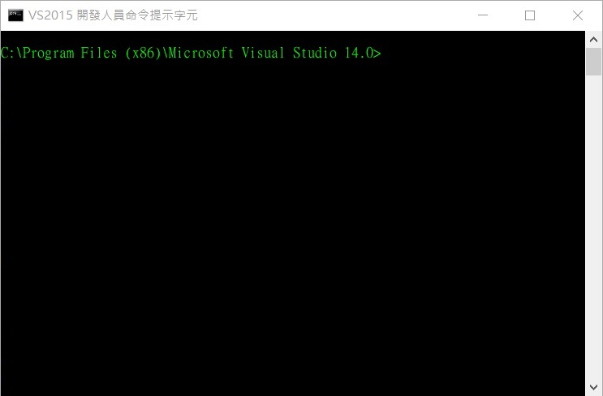
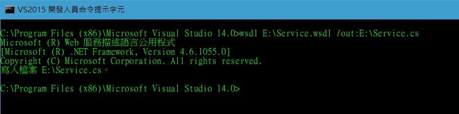

# 將 .wsdl 轉成 .cs

## 使用 Visal Studio 內建工具

開啟**VS2015 開發人員命令提示字元**

> 開始 > Visual Studio 2015 > VS2015 開發人員命令提示字元

或是直接到安裝路徑下開啟

> C:\Program Files (x86)\Microsoft Visual Studio 14.0\Common7\Tools\VsDevCmd.bat

在命令列輸入

> wsdl E:\Service.wsdl /out:E:\Service.cs

指定要轉換的 wsdl 並指定要輸出的路徑、名稱(可不輸入路徑，輸出的 cs 會在執行的目錄下)

