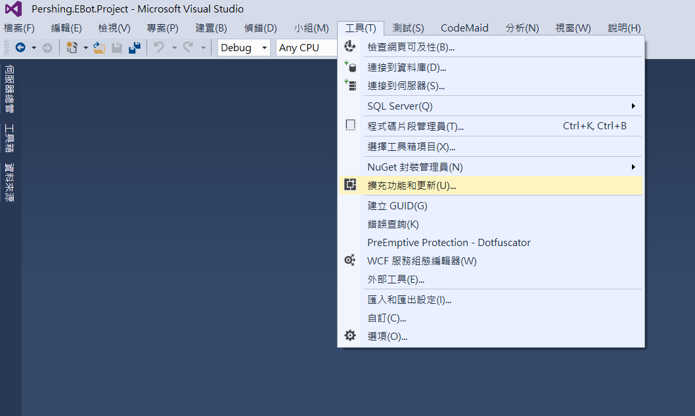
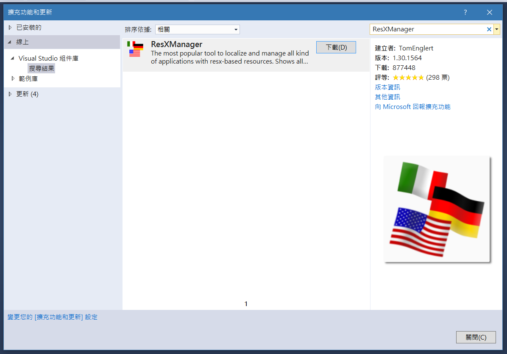
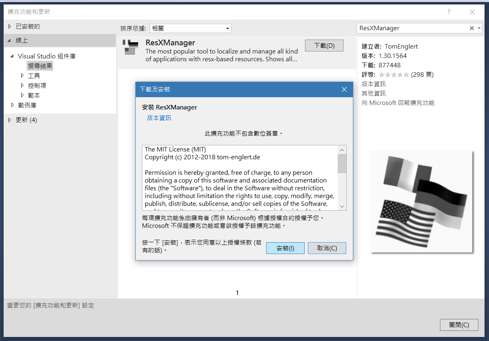
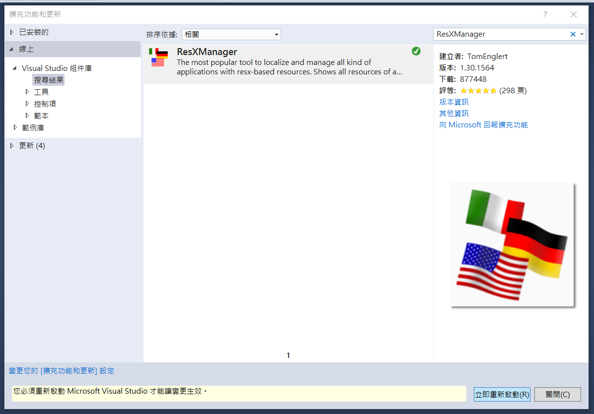
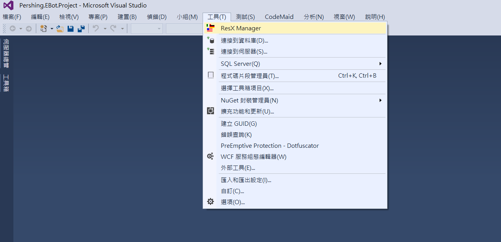
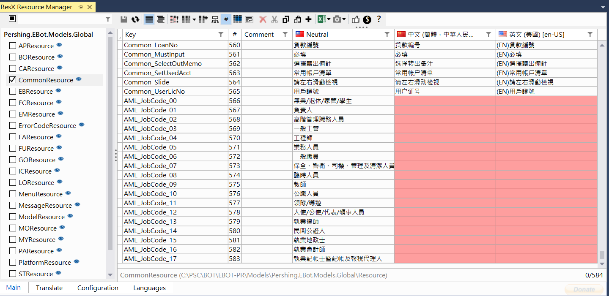
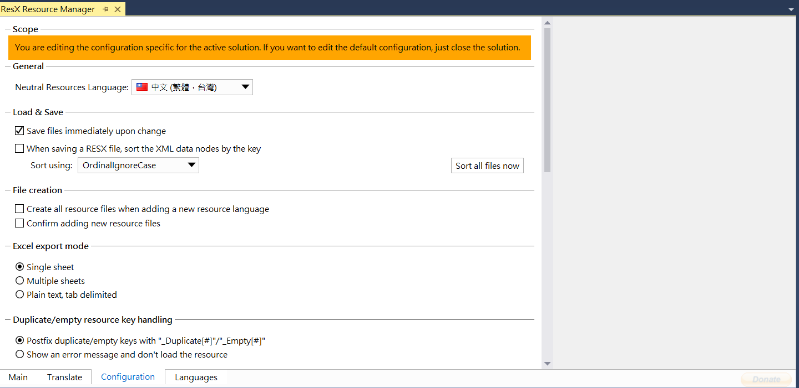
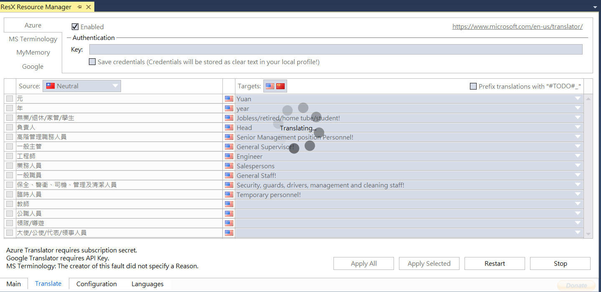
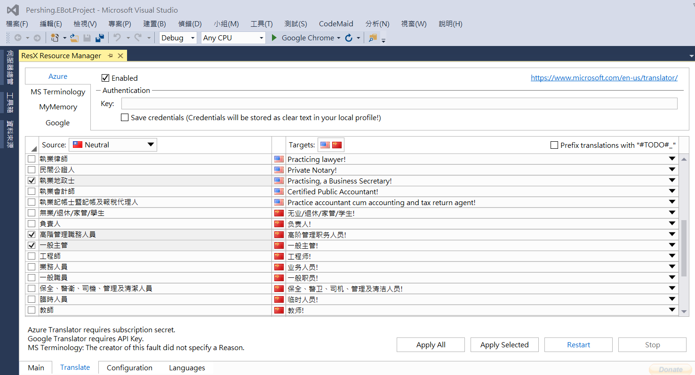
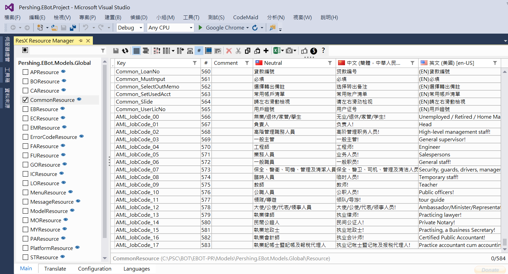

# 多語系套件 ResXManager

## 安裝
* 點選工具 > 擴充功能和更新

* 點選線上
* 搜尋 ResXManager
* 點選下載

* 點選安裝

* 安裝完成，重新啟動 Visual Studio

## 開啟 ResXManager

* 點選工具 > ResX Manager

* 左側會列出專案中所有的多語檔
* 有缺漏的部份會有顏色標記

## 線上即時翻譯

* 首次開啟 Nectral 預設為英文(美國)
* 點選下方頁籤 Configuration
* 將 Neutral Resources Language 設為中文

* 點選下方頁籤 Translate
* 點選 Restart 就可以線上翻譯囉！

* 線上翻譯完成後，可以勾選要套用的項目(Apply Select)或全部套用(Apply All)

* 回到 Main 就可以看到套用的結果囉！

