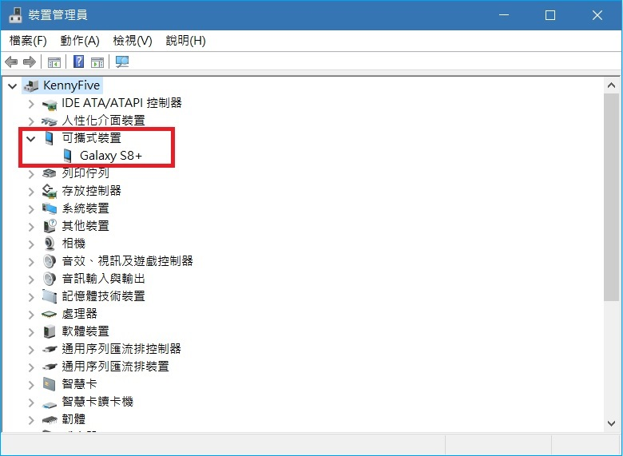
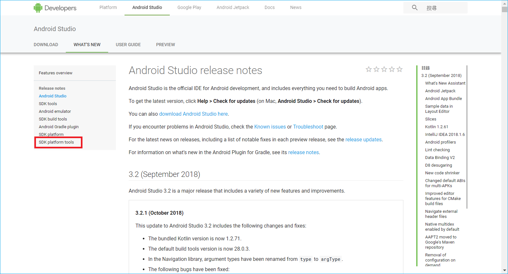
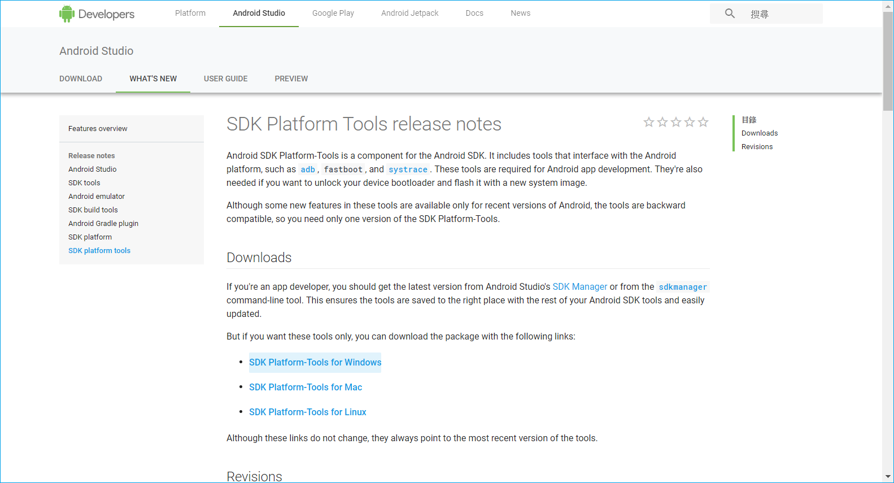
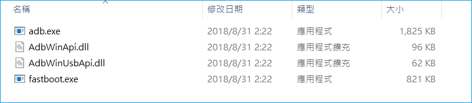
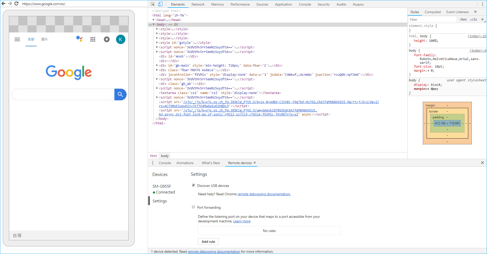

# chrome remote

在使用 chrome remote debugging 之前，需要一些簡單的設定

chrome 怎麼安裝就不用說了，比較麻煩的就是要當找不到 Android 時，要使用 adb (Android Debug Bridge) 連接裝置。

## 要求
1. 電腦需安裝 Chrome 32 或更高版本。
2. 電腦安裝 USB 驅動程序（如果您使用 Windows）。
3. 一條連接電腦跟 Android 設備的 USB 線。
4. Android 4.0 或更高版本。
5. Android 設備上已安裝 Chrome（Android 版）。

## 第一步：準備連接 Android 設備
1. Android 開啟**開發人員選項**
   * 打開 設定 > 關於手機 > 軟體資訊
   * 點擊七次「版本號碼」開啟**開發人員選項**
   * 回到「設定」最下面就會出現**開發人員選項**

2. Android 開啟**USB 偵錯**
   * 設定 > 開發人員選項 > USB 偵錯

3. 使用 USB 線連接電腦

## 第二步：找到你的 Android 設備
打開 chrome **開發人員工具**(F12 or Ctrl+Shift+I)

點擊 Main Menu 主菜單 ⋮ ，然後選擇 More tools > Remote devices

*P.S. 無痕模式 & 訪客模式無法使用 Remote devices*

確認 Settings 下的 Discover USB devices 有勾選

左邊 Devices 有出現 Connected 的裝置就是連線成功了，可以直接跳到第三步開始 debbuging 囉!

### Android Debug Bridge(adb)

如果 Devices 沒有出現任何裝置的話，先檢查 控制台 > 裝置管理員 是不是有顯示 Android，有出現的話我們就要來裝 adb (Android Debug Bridge) 連接裝置

網路上一堆說到官網下載 adb.exe 執行就可以，結果都沒說在哪...我載了一堆都找不到，所以才有了這篇

官網 https://developer.android.com/studio/

進入官網點選「RELEASE NOTES」

左邊選單選擇「SDK platform tools」

根據作業系統選擇你要下載的連結，我這邊是下載 Windows 的

 勾選「I have read and agree with the above terms and conditions」，點選「DOWNLOAD SDK Platform-Tools for Windows」按鈕就會開始下載了

下載之後會得到一個 zip，把這個 zip 解壓縮到你要地方

一般只需要 4 個檔案，其他可以刪掉
* adb.exe
* AdbWinApi.dll
* AdbWinUsbApi.dll
* fastboot.exe

打開 CMD 切到剛剛解壓縮的路徑

執行 > adb.exe devices

就會列出目前所有的 Android 裝置

再次打開 Main Menu 主菜單 ⋮ > More tools > Remote devices

左邊 Devices 就會出現 Connected 的裝置

## 第三步，與 Android 畫面同步

點選左邊的 Android 裝置

這邊會列出 Android 裝置所有的分頁(無論你的 Android 是否顯示 Chrome 畫面，只要背景有在運行即可)

對要 debugging 的網頁點選 Inspect 就可以開始 debugging 了哦！

