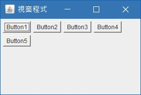
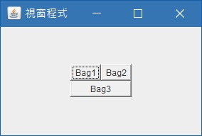

# 排版
* [FlowLayout](#FlowLayout)
* [GridLayout](#GridLayout)
* [GridBagLayout](#GridBagLayout)
* [no Layout](#noLayout)

- - -
<h2 id="FlowLayout">FlowLayout</h2>
將物件依序排列，並無任何框框限制，可選擇由左邊或右邊開始排列

    jframe.getContentPane().setLayout(new FlowLayout(FlowLayout.LEFT));
    Button button1 = new Button("Button1");
    Button button2 = new Button("Button2");
    Button button3 = new Button("Button3");
    Button button4 = new Button("Button4");
    Button button5 = new Button("Button5"); 
    jframe.add(button1);
    jframe.add(button2);
    jframe.add(button3);
    jframe.add(button4);
    jframe.add(button5);

<h2 id="GridLayout">GridLayout</h2>
GridLayout就像是一個表格，必需在一開始就指定表格要有幾欄及幾列，指定的欄數及列數會等分整個ContentPane的空間。使用方法如下：

    jframe.getContentPane().setLayout(new GridLayout(3,2));
    Button button1 = new Button("Button1");
    Button button2 = new Button("Button2");
    Button button3 = new Button("Button3");
    Button button4 = new Button("Button4");
    Button button5 = new Button("Button5");
    jframe.add(button1);
    jframe.add(button2);
    jframe.add(button3);
    jframe.add(button4);
    jframe.add(button5);

<h2 id="GridBagLayout">GridBagLayout</h2>
有了GridLayout，大部分的人應該都會想到合併儲存格。GridBagLayout就是在GridLayout的基礎上面增加合併儲存格的概念，不過寫法卻比GridLayout複雜許多。用法如下：

    jframe.setLayout(new GridBagLayout());
    
    GridBagConstraints bag1 = new GridBagConstraints(0,0,1,1,0,0,
    	GridBagConstraints.WEST,GridBagConstraints.NONE,new Insets(0,0,0,0),0,0);
    jframe.add(new Button("Bag1"), bag1);
    
    GridBagConstraints bag2 = new GridBagConstraints(1,0,1,1,0,0,
    	GridBagConstraints.WEST,GridBagConstraints.NONE,new Insets(0,0,0,0),0,0);
    jframe.add(new Button("Bag2"), bag2);
    
    GridBagConstraints bag3 = new GridBagConstraints(0,1,2,1,0,0,
    	GridBagConstraints.WEST,GridBagConstraints.BOTH,new Insets(0,0,0,0),0,0);
    jframe.add(new Button("Bag3"), bag3);

首先，一樣指定ContentPane的Layout為GridBagLayout，不同於GridLayout，GridBagLayout不需要事先指定列數及欄數，會根據後面加入的元件來調整相對應的位置。接下來要建立GridBagConstraints物件，GridBagConstraints有幾個參數可以設定，說明如下：

* gridx - 物件的起始位置座標X
* gridy - 物件的起始位置座標Y
* gridwidth - 物件橫向的合併儲存格數量
* gridheight - 物件縱向的合併儲存格數量
* weightx - 視窗變大時，元件跟著橫向變大的比例
* weighty - 視窗變大時，元件跟著縱向變大的比例
* anchor - 對齊的方式，有下列幾種值
<table>
<tr><td>GridBagConstraints.CENTER</td><td>中央對齊</td></tr>
<tr><td>GridBagConstraints.EAST</td><td>向右對齊</td></tr>
<tr><td>GridBagConstraints.SOUTHEAST</td><td>右下對齊</td></tr>
<tr><td>GridBagConstraints.SOUTH</td><td>向下對齊</td></tr>
<tr><td>GridBagConstraints.SOUTHWEST</td><td>左下對齊</td></tr>
<tr><td>GridBagConstraints.WEST</td><td>向左對齊</td></tr>
<tr><td>GridBagConstraints.NORTHWEST</td><td>左上對齊</td></tr>
<tr><td>GridBagConstraints.NORTH</td><td>向上對齊</td></tr>
<tr><td>GridBagConstraints.NORTHEAST</td><td>右上對齊</td></tr>
</table>

* fill - 元件填滿的程度，有下列幾種值
<table>
<tr><td>GridBagConstraints.NONE</td><td>不填滿</td></tr>
<tr><td>GridBagConstraints.HORIZONTAL</td><td>水平方向填滿</td></tr>
<tr><td>GridBagConstraints.VERTICAL</td><td>垂直方向填滿</td></tr>
<tr><td>GridBagConstraints.BOTH</td><td>水平及垂直方向都填滿</td></tr>
</table>

* insets - 設置組件之間彼此的間距，它有四個參數(上、左、下、右)
* ipadx - 例：按鈕文字與按鈕邊框水平的間距
* ipady - 例：按鈕文字與按鈕邊框垂直的間距

<h2 id="noLayout">no Layout</h2>
也可以不使用 layout 的方式，自行設定元件的位置

    jframe.setLayout(null);
    Container cp = jframe.getContentPane();

    JButton f01 = new JButton("button1");
    f01.setBounds(10, 10, 100, 50);
    cp.add(f01);

    JButton f02 = new JButton("button2");
    f02.setBounds(10, 70, 100, 100);
    cp.add(f02);

    JButton f03 = new JButton("button3");
    f03.setBounds(10, 180, 200, 200);
    cp.add(f03);

將 Layout 設為 null，再透過 setBounds() 針對每一個元件去設定位置、大小

* x - 畫面座標x
* y - 畫面座標y
* width - 元件的寬度
* height - 元件的高度

