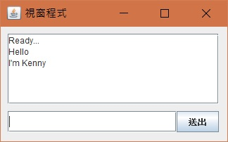

# Listener

增加 ActionListener 事件 - 按下時觸發

在下面輸入框文字，按下[送出]後將文字顯示在上面的 textbox 中

    jframe.setLayout(null);
    Container cp = jframe.getContentPane();

    JTextArea m01 = new JTextArea("Ready...\r\n");
    m01.setEditable(false); //禁止輸入
    m01.setLineWrap(true); //自動換行
    m01.setWrapStyleWord(true); //斷行不斷字
    JScrollPane sbrText = new JScrollPane(m01);
    sbrText.setBounds(10, 10, 300, 100);
    cp.add(sbrText);

    JTextField m02 = new JTextField();
    m02.setBounds(10, 120, 240, 30);
    cp.add(m02);

    JButton m03 = new JButton("送出");
    m03.setBounds(250, 120, 60, 30);
    cp.add(m03);

    m03.addActionListener(ae -> {
        m01.append(String.format("%s\r\n", m02.getText()));
        m02.setText("");
    });

