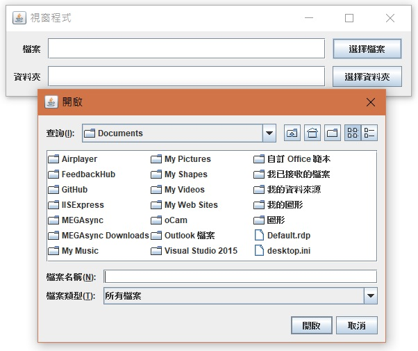

# 雜七雜八的，不知道要歸在哪

等我有想到再來新增其他的

* [TextArea ScrollBar做法](#TextAreaScrollBar)
* [選擇檔案 or 目錄](#selectFileOrDir)

- - -
<h2 id="TextAreaScrollBar">TextArea ScrollBar做法</h2>

    jframe.setLayout(null);
    Container cp = jframe.getContentPane();

    JTextArea m01 = new JTextArea("Ready...\r\n");
    m01.setEditable(false); //禁止輸入
    m01.setLineWrap(true); //自動換行
    m01.setWrapStyleWord(true); //斷行不斷字
    JScrollPane sbrText = new JScrollPane(m01);
    sbrText.setVerticalScrollBarPolicy(JScrollPane.VERTICAL_SCROLLBAR_ALWAYS); //scrollBar 預設顯示
    sbrText.setBounds(10, 10, 300, 300);
    cp.add(sbrText);

<h2 id="selectFileOrDir">選擇檔案 or 目錄</h2>

    jframe.setLayout(null);
    Container cp = jframe.getContentPane();

    // 選擇檔案
    JLabel n11 = new JLabel("檔案", JLabel.RIGHT);
    n11.setBounds(10, 10, 40, 30);
    cp.add(n11);

    JTextField n12 = new JTextField();
    n12.setBounds(60, 10, 400, 30);
    cp.add(n12);

    JButton n13 = new JButton("選擇檔案");
    n13.setBounds(470, 10, 100, 30);
    cp.add(n13);

    n13.addActionListener(ae -> {
        JFileChooser fileChooser = new JFileChooser();//宣告filechooser
        fileChooser.setCurrentDirectory(new java.io.File(n12.getText()));
        int returnValue = fileChooser.showOpenDialog(null);//叫出filechooser
        //判斷是否選擇檔案
        if (returnValue == JFileChooser.APPROVE_OPTION) {
        File selectedFile = fileChooser.getSelectedFile();//指派給File
        n12.setText(selectedFile.getPath());
        }
    });

    // 選擇資料夾
    JLabel n21 = new JLabel("資料夾", JLabel.RIGHT);
    n21.setBounds(10, 50, 40, 30);
    cp.add(n21);

    JTextField n22 = new JTextField();
    n22.setBounds(60, 50, 400, 30);
    cp.add(n22);

    JButton n23 = new JButton("選擇資料夾");
    n23.setBounds(470, 50, 100, 30);
    cp.add(n23);

    n23.addActionListener(ae -> {
        JFileChooser fileChooser = new JFileChooser();
        fileChooser.setCurrentDirectory(new java.io.File(n22.getText()));
        fileChooser.setDialogTitle("資料來源");
        fileChooser.setFileSelectionMode(JFileChooser.DIRECTORIES_ONLY);
        fileChooser.setAcceptAllFileFilterUsed(false);
        if (fileChooser.showOpenDialog(null) == JFileChooser.APPROVE_OPTION) {
        n22.setText(fileChooser.getSelectedFile().toString());
        }
    });

