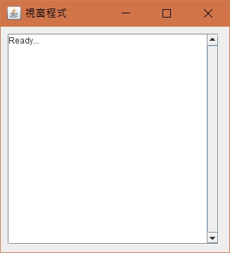

# 雜七雜八的，不知道要歸在哪

等我有想到再來新增其他的

* [TextArea ScrollBar做法](#TextAreaScrollBar)
* [選擇檔案 or 目錄](#selectFileOrDir)

- - -
<h2 id="TextAreaScrollBar">TextArea ScrollBar做法</h2>

    jframe.setLayout(null);
    Container cp = jframe.getContentPane();

    JTextArea m01 = new JTextArea("Ready...\r\n");
    m01.setEditable(false); //禁止輸入
    m01.setLineWrap(true); //自動換行
    m01.setWrapStyleWord(true); //斷行不斷字
    JScrollPane sbrText = new JScrollPane(m01);
    sbrText.setVerticalScrollBarPolicy(JScrollPane.VERTICAL_SCROLLBAR_ALWAYS); //scrollBar 預設顯示
    sbrText.setBounds(10, 10, 300, 300);
    cp.add(sbrText);

<h2 id="selectFileOrDir">選擇檔案 or 目錄</h2>
