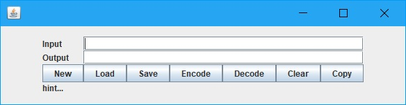

# GridBagLayout
GridBagLayout 的作法是把視窗分成一個一個的格子 (grid) ，然後把小工具 (widget) 放到選定的格子中，可依視窗元件的大小設定佔用的格子數

當視窗設定為 GridBagLayout 的排版方式後，視窗物件利用 add() 方法加入視窗元件時，必須額外提供 GridBagConstraints 類別 (class) 的參數 (parameter) ，因為實際的設定是由 GridBagConstraints 型態的物件 (object) 來完成的。

<table>
<tr><td>int gridx</td><td>行數</td></tr>
<tr><td>int gridy</td><td>列數</td></tr>
<tr><td>int gridwidth</td><td>行寬</td></tr>
<tr><td>int gridheight</td><td>列高</td></tr>
<tr><td>double weightx</td><td>用來設置當窗口變大時，各組件沿水平方向跟著變大的比例，數字越大，表示組件能得到的空間越大</td></tr>
<tr><td>double weighty</td><td>用來設置當窗口變大時，各組件沿垂直方向跟著變大的比例，數字越大，表示組件能得到的空間越大</td></tr>
<tr><td>int anchor</td><td>定位點</td></tr>
<tr><td>int fill</td><td>填滿方式</td></tr>
<tr><td>Insets insets</td><td>設置組件之間彼此的間距，它有四個參數(上、左、下、右)</td></tr>
<tr><td>int ipadx</td><td>例：按鈕文字與按鈕邊框水平的間距</td></tr>
<tr><td>int ipady</td><td>例：按鈕文字與按鈕邊框垂直的間距</td></tr>
</table>

* 填滿方式

<table>
<tr><td>GridBagConstraints.BOTH</td><td>垂直水平都填滿</td></tr>
<tr><td>GridBagConstraints.VERTICAL</td><td>垂直填滿</td></tr>
<tr><td>GridBagConstraints.HORIZONTAL</td><td>水平填滿</td></tr>
<tr><td>GridBagConstraints.NONE</td><td>不填滿</td></tr>
</table>

* 定位點

<table>
    <tr>
        <td>GridBagConstraints.NORTHWEST 左上對齊</td>
        <td>GridBagConstraints.NORTH 向上置中</td>
        <td>GridBagConstraints.NORTHEAST 右上對齊</td>
    </tr>
    <tr>
        <td>GridBagConstraints.WEST 靠左對齊</td>
        <td>GridBagConstraints.CENTER 置中對齊</td>
        <td>GridBagConstraints.EAST 靠右對齊</td>
    </tr>
    <tr>
        <td>GridBagConstraints.SOUTHWEST 左下對齊</td>
        <td>GridBagConstraints.SOUTH 向下置中</td>
        <td>GridBagConstraints.SOUTHEAST 右下對齊</td>
    </tr>
</table>

    package Swing;
    
    import javax.swing.*;
    import java.awt.*;
    
    public class EncryptorGUI {
    
        public static void main(String[] args) {
            EncryptorGUI gui = new EncryptorGUI();
            gui.run();
        }
    
        public void run() {
            JFrame frame = new JFrame();
            frame.setSize(600, 160);
            frame.setLayout(new GridBagLayout());
            frame.setDefaultCloseOperation(JFrame.EXIT_ON_CLOSE);
            frame.setLocation(0, 0); // --     設定視窗開啟時左上角的座標，也可帶入Point物件
            frame.setLocationRelativeTo(null); // --     設定開啟的位置和某個物件相同，帶入null則會在畫面中間開啟
    
            // Input
            JLabel n0 = new JLabel("Input");
            GridBagConstraints c0 = new GridBagConstraints(0, 0, 1, 1, 0, 0,
                    GridBagConstraints.WEST, GridBagConstraints.NONE, new Insets(0, 0, 0, 0), 0, 0);
            frame.add(n0, c0);
    
            JTextField n1 = new JTextField();
            GridBagConstraints c1 = new GridBagConstraints(1, 0, 6, 1, 0, 0,
                    GridBagConstraints.WEST, GridBagConstraints.BOTH, new Insets(0, 0, 0, 0), 50, 0);
            frame.add(n1, c1);
    
            // Output
            JLabel n2 = new JLabel("Output");
            GridBagConstraints c2 = new GridBagConstraints(0, 1, 1, 1, 0, 0,
                    GridBagConstraints.WEST, GridBagConstraints.NONE, new Insets(0, 0, 0, 0), 0, 0);
            frame.add(n2, c2);
    
            JTextField n3 = new JTextField();
            GridBagConstraints c3 = new GridBagConstraints(1, 1, 6, 1, 0, 0,
                    GridBagConstraints.WEST, GridBagConstraints.BOTH, new Insets(0, 0, 0, 0), 0, 0);
            frame.add(n3, c3);
    
            // hint...
            JLabel n4 = new JLabel("hint...");
            GridBagConstraints c4 = new GridBagConstraints(0, 3, 7, 1, 0, 0,
                    GridBagConstraints.WEST, GridBagConstraints.BOTH, new Insets(0, 0, 0, 0), 0, 0);
            frame.add(n4, c4);
    
            String[] name = {"New", "Load", "Save", "Encode", "Decode", "Clear", "Copy"};
            for (int i = 0; i < 7; i++) {
                JButton n5 = new JButton(name[i]);
                GridBagConstraints c5 = new GridBagConstraints(i, 2, 1, 1, 0, 0,
                        GridBagConstraints.CENTER, GridBagConstraints.NONE, new Insets(0, 0, 0, 0), 0, 0);
                frame.add(n5, c5);
            }
    
            frame.setVisible(true);
        }
    }

