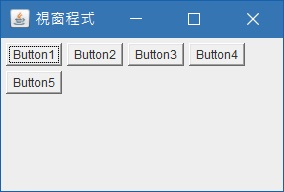
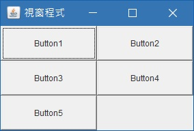
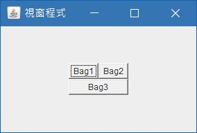

# 排版
* [FlowLayout](#FlowLayout)
* [GridLayout](#GridLayout)
* [GridBagLayout](#GridBagLayout)

<h2 id="FlowLayout">FlowLayout</h2>
將物件依序排列，並無任何框框限制，可選擇由左邊或右邊開始排列

    jframe.getContentPane().setLayout(new FlowLayout(FlowLayout.LEFT));
    Button button1 = new Button("Button1");
    Button button2 = new Button("Button2");
    Button button3 = new Button("Button3");
    Button button4 = new Button("Button4");
    Button button5 = new Button("Button5"); 
    jframe.add(button1);
    jframe.add(button2);
    jframe.add(button3);
    jframe.add(button4);
    jframe.add(button5);

- - -
<h2 id="GridLayout">GridLayout</h2>
GridLayout就像是一個表格，必需在一開始就指定表格要有幾欄及幾列，指定的欄數及列數會等分整個ContentPane的空間。使用方法如下：

    jframe.getContentPane().setLayout(new GridLayout(3,2));
    Button button1 = new Button("Button1");
    Button button2 = new Button("Button2");
    Button button3 = new Button("Button3");
    Button button4 = new Button("Button4");
    Button button5 = new Button("Button5");
    jframe.add(button1);
    jframe.add(button2);
    jframe.add(button3);
    jframe.add(button4);
    jframe.add(button5);

- - -
<h2 id="GridBagLayout">GridBagLayout</h2>
有了GridLayout，大部分的人應該都會想到合併儲存格。GridBagLayout就是在GridLayout的基礎上面增加合併儲存格的概念，不過寫法卻比GridLayout複雜許多。用法如下：

    jframe.setLayout(new GridBagLayout());
     
    GridBagConstraints bag1 = new GridBagConstraints();
    bag1.gridx = 0;
    bag1.gridy = 0;
    bag1.gridwidth = 1;
    bag1.gridheight = 1;
    bag1.weightx = 0;
    bag1.weighty = 0;
    bag1.fill = GridBagConstraints.NONE;
    bag1.anchor = GridBagConstraints.WEST;
    jframe.add(new Button("Bag1"), bag1);
     
    GridBagConstraints bag2 = new GridBagConstraints();
    bag2.gridx = 1;
    bag2.gridy = 0;
    bag2.gridwidth = 1;
    bag2.gridheight = 1;
    bag2.weightx = 0;
    bag2.weighty = 0;
    bag2.fill = GridBagConstraints.NONE;
    bag2.anchor = GridBagConstraints.WEST;
    jframe.add(new Button("Bag2"), bag2);
     
    GridBagConstraints bag3 = new GridBagConstraints();
    bag3.gridx = 0;
    bag3.gridy = 1;
    bag3.gridwidth = 2;
    bag3.gridheight = 1;
    bag3.weightx = 0;
    bag3.weighty = 0;
    bag3.fill = GridBagConstraints.BOTH;
    bag3.anchor = GridBagConstraints.WEST;
    jframe.add(new Button("Bag3"), bag3);

