# Nexus 2

1. 下載
https://www.sonatype.com/download-oss-sonatype

___Nexus 3 只提供 64bit，32bit 請下載 Nexus 2___

2. 本篇以 Nexus 2 為主，網頁向下移，點選右下的 CLICK HERE

___Nexus 2 需要 JDK 1.8 以下的版本，之後的版本啟動可能會失敗___

3. Nexus 專業版是需要付費的，這裡我們下載開源版 Nexus OSS。Nexus 提供兩種安裝包，一種是包含 Jetty 容器的 bundle 包，另一種是不包含容器的 war 包。

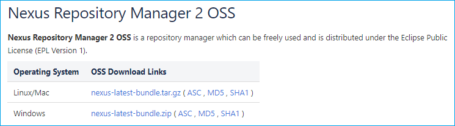

4. 將 Zip 解壓縮，會看到以下資料夾

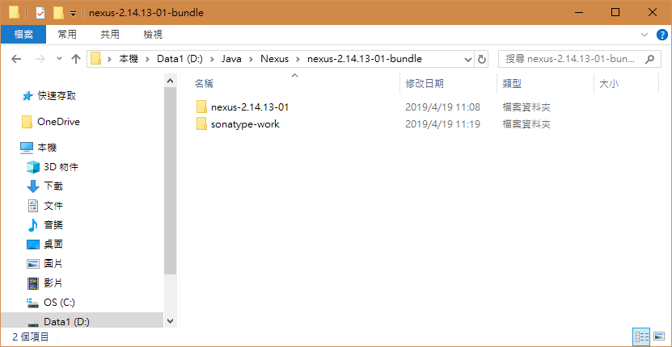

## Nexus 安裝、啟動

1. nexus 預設的 port 為 8081，你也可以在 nexus.properties 修改

> ~\nexus-2.14.13-01\conf\nexus.properties

	application-port=8081

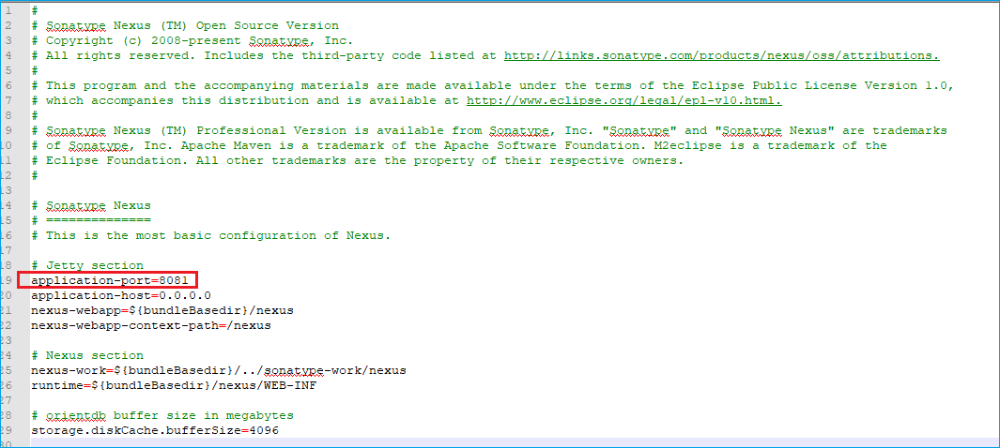

2. 以管理者權限打開 CMD 執行 nexus

先執行移至解壓縮的路徑 ~\nexus-2.14.13-01\bin\

執行下面指令

	nexus install
	nexus start

其他的指令可以直接輸入 nexus 查詢

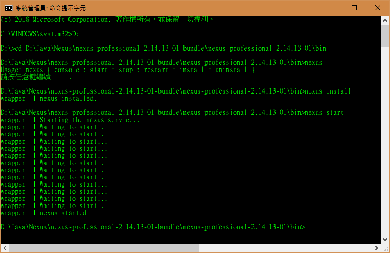

#### Error: Nexus 安裝、啟動

__如果你出現以下錯誤就是你的權限不足__

Win10 請用「以執行管理員身分執行」啟動CMD

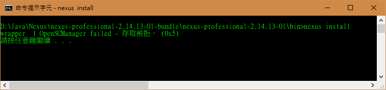

__啟動失敗 wrapper  | The nexus service was launched, but failed to start.__

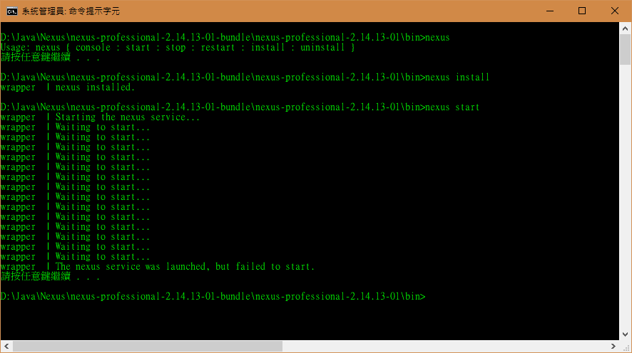

你的 JAVA JDK 版本可能高於 1.8，可以在 wrapper.conf 修改執行的 JDK 版本

> ~\nexus-2.14.13-01\bin\jsw\conf\wrapper.conf

	wrapper.java.command=C:\Program Files (x86)\Java\OpenJDK\java-se-8u40-ri\bin\java

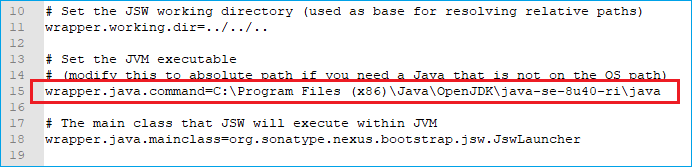

## 開始使用 Nexus

1. 打開 Browser 輸入 http://localhost:8081/nexus 或 http://127.0.0.1:8081/nexus ，看到以下畫面就可以開始使用囉！

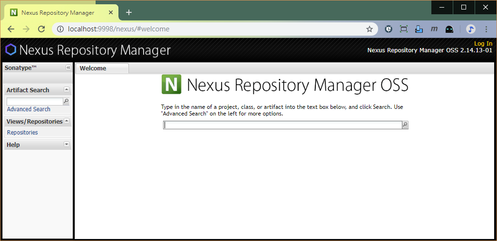

2. 點選右上角 Log In 輸入預設使用者

	Username: admin
	Password: admin123

3. 登入後在左邊點選「Repositories」，就會看到很多的 Repositorie

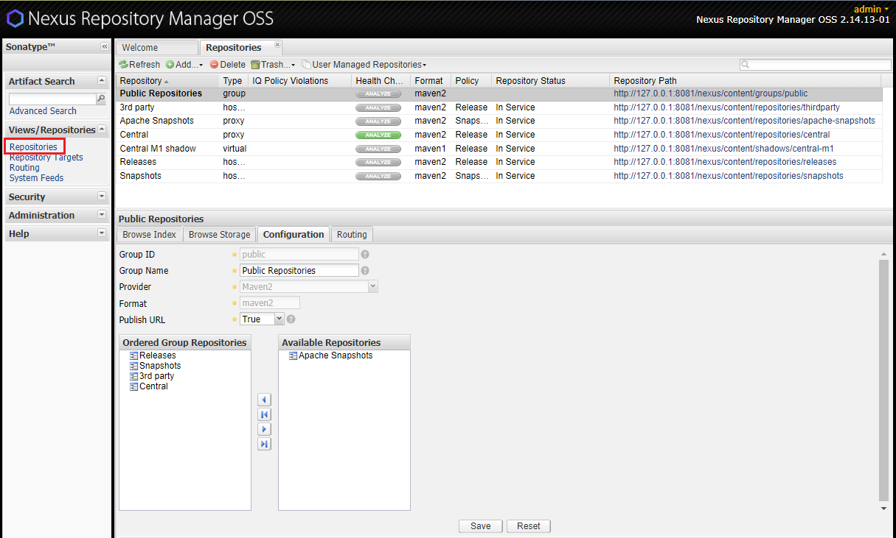

<table>
    <tr>
        <td>Public Repositories</td>
        <td>Group, 預設包含 Releases、Snapshots、3rd party、Central</td>
    </tr>
    <tr>
        <td>Releases</td>
        <td>自行發行的穩定版本</td>
    </tr>
    <tr>
        <td>Snapshots</td>
        <td>自行發行的測試版本</td>
    </tr>
    <tr>
        <td>3rd party</td>
        <td>第三方發行的，但不在 Maven 托管內</td>
    </tr>
    <tr>
        <td>Central</td>
        <td>Maven 的中央資料庫</td>
    </tr>
</table>

4. Central 更新索引

基本上安裝完，所有的資料庫都是空的，所以我們會先更新 Central，又分為自動更新、手動更新

### 自動更新

1. 選擇 Central

2. 選擇 Configuration

3. 將 Download Remote Indexes 設為 true

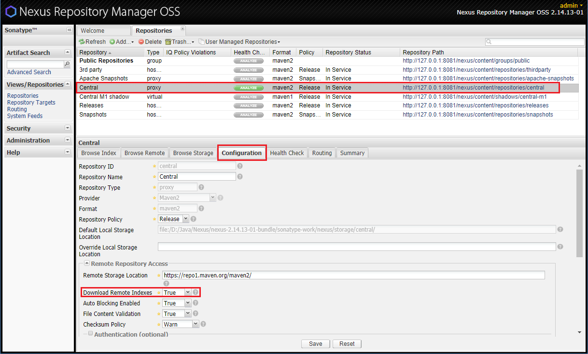

4. Central 右鍵 Update Index

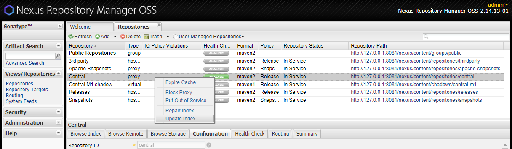

5. 在左邊的 Administration > Scheduled Tasks 就會出現一個 Update Repositories Index 正在執行中(這個要跑蠻久的)

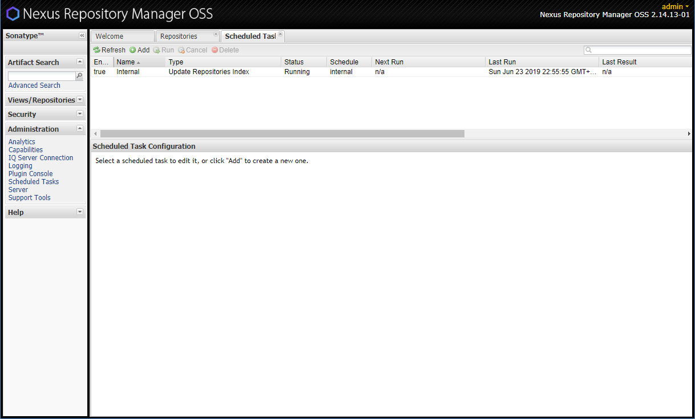

6. 回到 Central 選擇 Browser Index

7. Refresh 之後有看到很多檔案就表示更新成功了

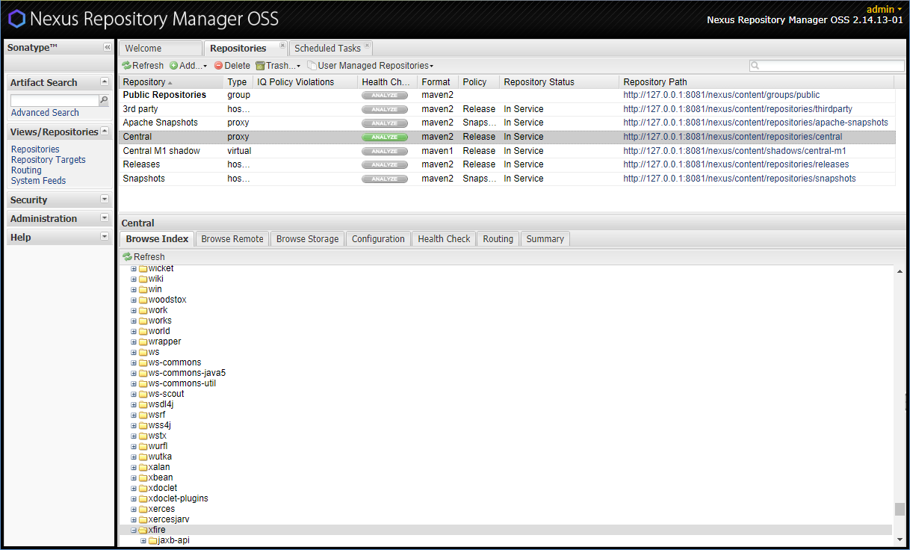

#### Error: 自動更新

__In Service - Remote Automatically Blocked and Unavailable__

Google 大部份會說是網路連線問題，但我直接用 Browser 連到 https://repo1.maven.org/maven2/ 是沒有問題的

查看 ~\nexus-2.14.13-01\logs\wrapper.log 發現是 Java 沒有執行 SSL 的權限

我的 lib 的檔案很少

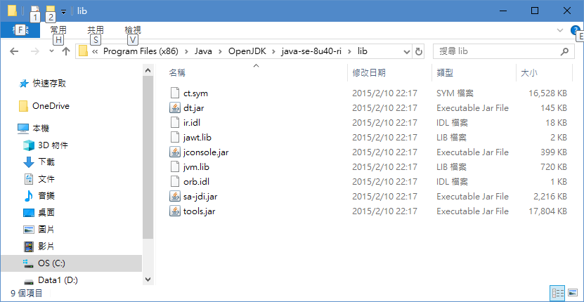

正常的 lib  

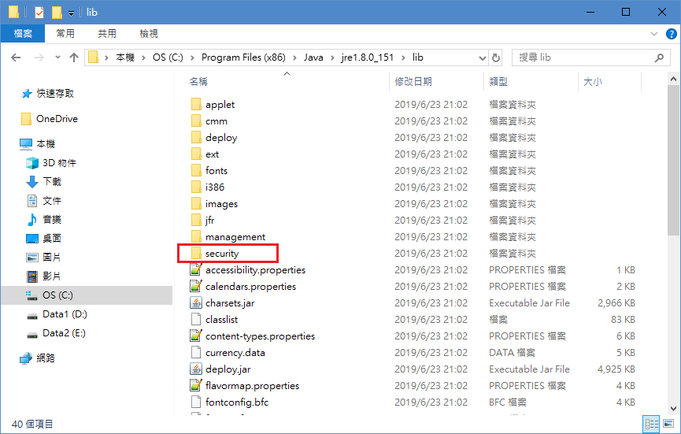

重新下載一個有包含 security 的 JDK 版本，修改執行的 [wrapper.conf](#wrapper.conf)

重新啟動 nexus 就行了

	nexus restart

### 手動更新

1. 到 http://repo.maven.apache.org/maven2/.index/ 下載(基本上在頁尾)
	* nexus-maven-repository-index.gz
	* nexus-maven-repository-index.properties

2. 下載 indexer-cli-5.1.1.jar
> https://mvnrepository.com/artifact/org.apache.maven.indexer/indexer-cli/5.1.1

3. 三個檔案放在同一個資料夾，用 CMD 執行

	java -jar indexer-cli-5.1.0.jar -u nexus-maven-repository-index.gz -d indexer
	
4. 刪除 D:\Java\Nexus\nexus-2.14.13-01-bundle\sonatype-work\nexus\indexer\public-ctx\ 下的所有檔案
	
5. 執行完會有一個 indexer 的資料夾，將 indexer 內所有檔案 copy 到 ~\sonatype-work\nexus\indexer\public-ctx\

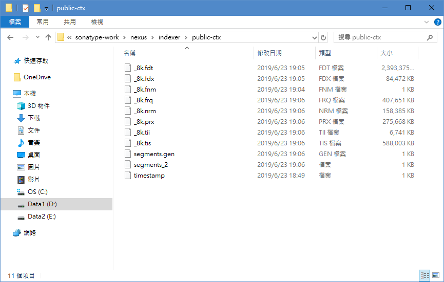

6. 重新啟動 nexus

	nexus restart