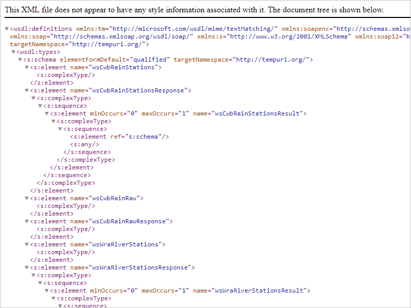
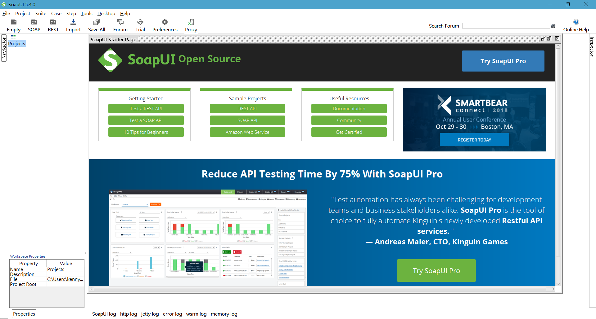
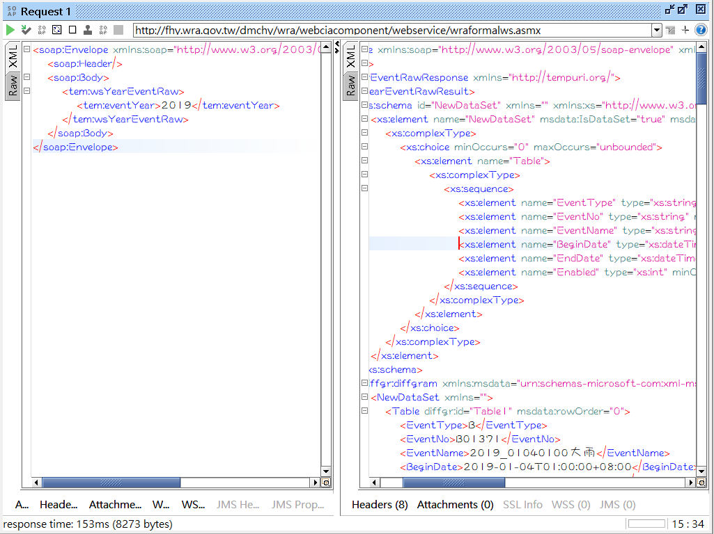

# SoapUI 操作說明

SoapUI 官網：https://www.soapui.org/

這裡我們下載 Open Source 的版本就可以了

點選首頁下面的 Open Source 進行下載就可以了

安裝就不說了...

- - -

接下以「經濟部水利署防災資訊網」的 Web Service 作為範例

wraformalws Web 服務 - 經濟部水利署防災資訊網：http://fhy.wra.gov.tw/dmchy/wra/webciacomponent/webservice/wraformalws.asmx

1. 打開水利署的網頁會看到可以用的 method

    

2. 點擊最上方的[服務描述](http://fhy.wra.gov.tw/dmchy/wra/webciacomponent/webservice/wraformalws.asmx?WSDL)接著進入 wsdl 或在網址後加上 ?WSDL

    

3. 右鍵 > 另存新檔，將 xml 描述存成 .wsdl 就可以了

    

4. 打開 SoapUI

    

5. 點選 file > New SOAP Project > 選擇剛剛下載的 wraformalws.wsdl

    

6. 點選 OK 之後就會看到左側選單出現 wsdl 中所有可供使用的 method

    

7. 但是所有的 method 都有兩個，到底要用哪一個呢

8. 將兩個 wsCwbRainRaw 點開會看到上面所定義的網址不同，分別是

    * http://schemas.xmlsoap.org/soap/envelope/
    * http://www.w3.org/2003/05/soap-envelope

    

9. 分別點進兩個網址就會發現一個是 SOAP 1.1 一個是 SOAP 1.2，表示 SoapUI 是支援 1.1 & 1.2 的測試

    

    

10. 接著我們就來發送一個 Request，點開 wsYearEventRaw

    

11. 上面的網址需對到 Web Service，如果你有多台 Web Servie 可以修改這邊進行測試

    

11. 這個畫面會看到一個 ? 表示這個是可以輸入的參數，根據水利署網站的說明，輸入2019

    > * wsYearEventRaw 
    > 年度事件原始列表資料，eventYear為西元年

12. 點擊左上的箭頭就可以發送 Request

    

13. Submit 成功之後就會看到右邊的視窗有 Response 回來囉！

    

14. 如果 Submit 後一直沒有 Response 回應的話，可以點 Raw 檢查 HTTP 有沒有錯誤訊息

    